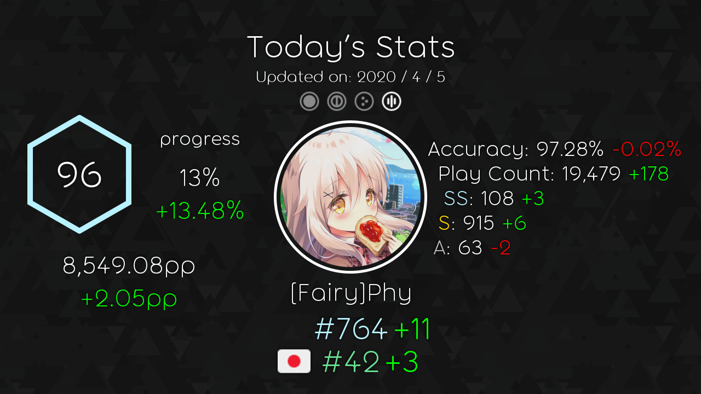

# Statosu Framework

[](https://travis-ci.com/Fairy-Phy/Statosu-Framework)
[](https://coveralls.io/github/Fairy-Phy/Statosu-Framework?branch=master)
[](https://opensource.org/licenses/MIT)

Statosu create image framework. I reworked the image creation of Statosu created last year as a framework!

There is no npm package or yarn package because it is made exclusively for Statosu.

## Installation

### 1, Install prerequisites

Since this framework contains [node-canvas](https://github.com/Automattic/node-canvas), prerequisite installation is required for each OS.

---

### Compiling

If you don't have a supported OS or processor architecture, or you use `--build-from-source`, the module will be compiled on your system. This requires several dependencies, including Cairo and Pango.

For detailed installation information, see the [wiki](https://github.com/Automattic/node-canvas/wiki/_pages). One-line installation instructions for common OSes are below. Note that libgif/giflib, librsvg and libjpeg are optional and only required if you need GIF, SVG and JPEG support, respectively. Cairo v1.10.0 or later is required.

OS | Command
----- | -----
OS X | Using [Homebrew](https://brew.sh/):<br/>`brew install pkg-config cairo pango libpng jpeg giflib librsvg`
Ubuntu | `sudo apt-get install build-essential libcairo2-dev libpango1.0-dev libjpeg-dev libgif-dev librsvg2-dev`
Fedora | `sudo yum install gcc-c++ cairo-devel pango-devel libjpeg-turbo-devel giflib-devel`
Solaris | `pkgin install cairo pango pkg-config xproto renderproto kbproto xextproto`
OpenBSD | `doas pkg_add cairo pango png jpeg giflib`
Windows | See the [wiki](https://github.com/Automattic/node-canvas/wiki/Installation:-Windows)
Others | See the [wiki](https://github.com/Automattic/node-canvas/wiki)

**Mac OS X v10.11+:** If you have recently updated to Mac OS X v10.11+ and are experiencing trouble when compiling, run the following command: `xcode-select --install`. Read more about the problem [on Stack Overflow](http://stackoverflow.com/a/32929012/148072).
If you have xcode 10.0 or higher installed, in order to build from source you need NPM 6.4.1 or higher.

Quote: https://github.com/Automattic/node-canvas#compiling

---

### 2, Install modules

Once the prerequisites have been installed, you only need to install the modules.

```sh
$ npm install
```

Please add `--production` option for normal use.

## Usage

```javascript
const framework = require("statosu_framework");
const fs = require("fs");

const osu_api_key = ""; // osu!api(v1) token
const ripple_api_key = ""; // Ripple API(v1) token

const twitter_data = {
    /* JSON data obtained from Statosu User twitter config database */
    osu_name: "", // osu!(ripple) username
    osu_mode: 3, // 0 => Std, 1 => Taiko, 2 => Ctb, 3 => Mania
    osu_server: 0 // 0 => Official server, 1 => Ripple server
};

const db_data = {
    /* JSON data obtained from Statosu Player data database */
    /* JSON data is obtained from the API in advance at a predetermined time and stored */
    /* Not required, but will not allow comparison with previous data */
};

framework.create_image(twitter_data, db_data, osu_api_key, ripple_api_key)
    .then(buffer => {
        fs.writeFile(__dirname + "/" + `./Test_image.png`, buffer, err => {
                if (err != null) throw new Error(err);
            }
        );
    });
```

## Example of output image

Font in the image uses [Torus font](https://paulogoode.com/torus/).



## Licence

Statosu framework is licensed under the [MIT License](https://opensource.org/licenses/MIT). Please see [the license file](LICENSE) for more information. Please also note that image fonts and [asset/icon/avatar-guest.png](asset/icon/avatar-guest.png) are another license. Please see [NDISCOVER/Exo-2.0](https://github.com/NDISCOVER/Exo-2.0), [googlefonts/comfortaa](https://github.com/googlefonts/comfortaa) and [ppy/osu-resources](https://github.com/ppy/osu-resources) repository for details.
